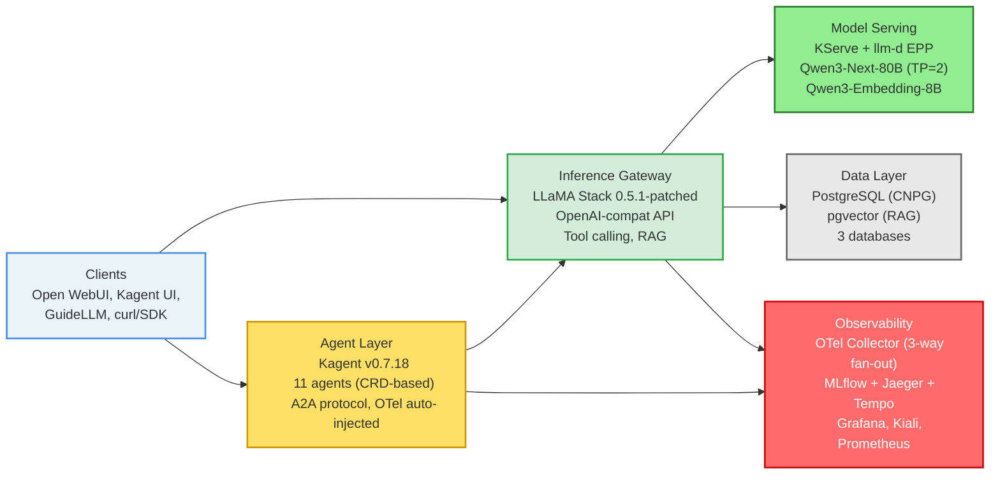

# Catalyst Lab Architecture

This document describes the deployed architecture of the AI Catalyst Lab -- a multi-tenant Kubernetes environment for LLM inference, agent orchestration, RAG, and end-to-end observability.

> **Authoritative diagram:** [`diagrams/lab-architecture.md`](./diagrams/lab-architecture.md) contains the full Mermaid diagram with node/edge reference tables and gap tracking.

## System Overview

## Components

### Agent Layer (namespace: `kagent`)

**Kagent v0.7.18** (CNCF Sandbox) provides Kubernetes-native agent orchestration via CRDs.

- **Controller** -- deploys each Agent CRD as a pod, injects OTel environment variables automatically, exposes A2A (Agent-to-Agent) endpoints
- **11 agents** -- 10 built-in (k8s, istio, helm, promql, kgateway, argo-rollouts, observability, 3x cilium) + 1 custom (`labdemo-agent` for lab operations)
- **kagent-tools** -- MCP tool server providing kubectl and helm access; RBAC scoped to read-only cluster-wide + write in `catalystlab-shared`
- **Kagent UI** -- web interface for agent interaction via A2A JSON-RPC

All 11 agents are Ready and producing OTel traces. Each agent query generates 90-200+ spans depending on tool call depth.

### Inference Gateway (namespace: `catalystlab-shared`)

**LLaMA Stack 0.5.1** runs as the unified API gateway for inference, tool calling, agentic workflows, and RAG.

- **Custom image** (`quay.io/aicatalyst/llamastack-starter:0.5.1-patched`) bakes in:
  - OTel auto-instrumentation (removed from upstream `latest`)
  - Agents API hotfix (NoneType crash when vLLM returns `content: null` with tool calls)
  - vLLM embedding dimensions compatibility fix (non-matryoshka `dimensions` rejection)
- **RAG pipeline** -- embedding via Qwen3-Embedding-8B, vector storage in pgvector, semantic search verified end-to-end
- **Istio sidecar** injected for mTLS between services
- **PostgreSQL-backed state** -- KV store, SQL store, and vector store all persist across restarts

### Model Serving (namespace: `kserve-lab`)

**KServe v0.16.0** with **llm-d inference scheduler** manages vLLM deployments.

| Model | Purpose | Config |
|-------|---------|--------|
| **Qwen3-Next-80B-A3B-Instruct-FP8** | Chat + tool calling | 1 replica, TP=2, hermes parser |
| **Qwen3-Embedding-8B** | Embeddings for RAG | 1 replica, 4096 dimensions |

- **llm-d EPP** routes requests via Envoy ext-proc. Basic routing active; advanced features (P/D disaggregation, KV offload, variant autoscaling) not configured.

### Observability

The observability stack provides four complementary views of the same trace data.

**OTel Collector** (namespace: `catalystlab-shared`) receives OTLP from all instrumented services and performs:
1. **Filtering** -- drops readiness/liveness probe spans and A2A health check spans (eliminates 108+ noise spans/min)
2. **Transform** -- injects `mlflow.spanType` from `gen_ai.operation.name`, sets `peer.service` for dependency graph edges
3. **3-way fan-out** -- exports to MLflow, Jaeger, and Tempo simultaneously

| Tool | Namespace | Purpose | Strength |
|------|-----------|---------|----------|
| **MLflow** | catalystlab-shared | Experiment tracking, trace storage | Span type analysis, experiment comparison |
| **Jaeger** | catalystlab-shared | Trace tree visualization | Deep trace inspection, 12-service dependency graph |
| **Tempo** | catalystlab-shared | Grafana-native tracing | Service graph via metrics generator, node graph panel |
| **Grafana** | monitoring | Dashboards | 10-panel "AI Catalyst Lab Overview" dashboard |
| **Kiali** | kiali | Istio mesh topology | Animated service graph, traffic flow visualization |
| **Prometheus** | monitoring | Metrics | Tempo service graph metrics via remote write |

### Data Layer (namespace: `catalystlab-shared`)

**PostgreSQL 17** via CloudNativePG operator, 1 replica with pgvector extension.

| Database | Consumer | Purpose |
|----------|----------|---------|
| `vectordb` | LLaMA Stack vector_io | RAG vector embeddings (4096-dim, sequential scan) |
| `llamastack` | LLaMA Stack | KV store, SQL store, agent state |
| `mlflow` | MLflow | Experiment metadata, trace storage |

### Benchmarking

**GuideLLM** runs as Kubernetes Jobs in the `guide-llm` namespace. Results are uploaded to MLflow via `scripts/guidellm_to_mlflow.py` for experiment comparison.

## Data Flow

### Inference Request Flow

1. Client sends request to **LLaMA Stack** (`:8321`, OpenAI-compatible API)
2. LLaMA Stack routes to **llm-d EPP** (`workload-svc:8000`)
3. EPP routes via Envoy ext-proc to **vLLM** (Qwen3-Next-80B)
4. vLLM returns generated tokens back through the chain

### Agent Request Flow

1. User interacts via **Kagent UI** (A2A JSON-RPC)
2. Kagent agent calls **LLaMA Stack** OpenAI-compatible API
3. LLaMA Stack executes inference + tool calls (may loop multiple times)
4. Agent returns structured response via A2A

### RAG Flow

1. Documents uploaded via LLaMA Stack Files API
2. LLaMA Stack chunks documents, calls **Qwen3-Embedding-8B** for embeddings
3. Embeddings stored in **pgvector** (`vectordb` database)
4. Semantic search queries embed the query, perform vector similarity search, return context

### Observability Flow

1. **LLaMA Stack** and **Kagent agents** emit OTLP traces to OTel Collector (`:4317`)
2. OTel Collector filters probe noise, transforms span attributes, batches
3. Fan-out to **MLflow** (OTLP/HTTP), **Jaeger** (OTLP/gRPC), **Tempo** (OTLP/gRPC)
4. **Tempo** pushes service graph metrics to **Prometheus** via remote write
5. **Grafana** queries Prometheus + Tempo for dashboard panels
6. **Kiali** reads Istio mesh topology independently

## Known Limitations

| Limitation | Impact | Status |
|------------|--------|--------|
| MLflow request/response preview empty | Cannot inspect prompt/completion in MLflow UI | Blocked on upstream openai-v2 `SPAN_AND_EVENT` mode |
| Jaeger content inspection not working | Cannot view span content in Jaeger | Needs LoggerProvider + logs pipeline |
| pgvector 2000-dim ANN index limit | 4096-dim embeddings use sequential scan | Acceptable for demo; consider lower-dim model for production |
| llm-d advanced features not configured | Basic routing only | P/D disaggregation, KV offload deferred |

## Deployment Considerations

### Resource Requirements

- **vLLM (Qwen3-Next-80B)**: 2 GPUs (tensor parallelism), GPU-enabled nodes required
- **vLLM (Qwen3-Embedding-8B)**: 1 GPU
- **PostgreSQL**: Persistent storage with adequate I/O
- **All other components**: Standard CPU/memory, no GPU required

### Security

- **Istio mTLS** between services in `catalystlab-shared`
- **Scoped RBAC** for kagent-tools (read-only cluster-wide, write in `catalystlab-shared`)
- **Istio AuthorizationPolicy** for namespace-level access control
- **Secret management** via `secretKeyRef` / `configMapKeyRef` in all manifests
- **Pre-commit hooks** prevent committing credentials, IPs, and sensitive data

### Multi-Tenancy

This is a shared cluster. Component ownership is distributed across the team:

| Area | Components |
|------|-----------|
| Infra / Platform | OTel Collector, LLaMA Stack, Kagent, MLflow, GuideLLM, PostgreSQL |
| Observability | Tempo, Kiali, Istio injection, Grafana |
| Model Serving | KServe, vLLM (Qwen3-Next-80B, Qwen3-Embedding-8B) |
| User Interface | Open WebUI |
