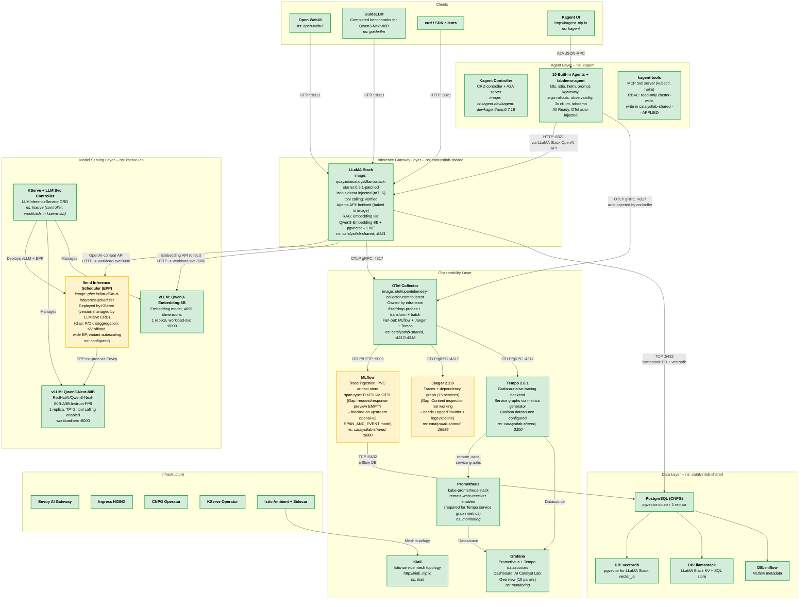

# AI Catalyst Lab -- Architecture Diagram

> **Legend:** Curly braces `{...}` indicate gaps between current and target state.
> Nodes without curly braces are fully live.

---

## Mermaid Diagram

---

## Node Reference Table

| Component | Namespace | Status | {Gaps} |
|-----------|-----------|--------|--------|
| **Kagent Controller** | kagent | LIVE | -- |
| **Kagent Agents (10 + labdemo)** | kagent | LIVE | All 11 Ready, OTel auto-injected |
| **Kagent Tools** | kagent | LIVE | Scoped RBAC applied: read-only cluster-wide, write in catalystlab-shared |
| **Kagent UI** | kagent | LIVE | Ingress at `kagent.<INGRESS_IP>.nip.io` |
| **LLaMA Stack** | catalystlab-shared | LIVE | Custom image (0.5.1-patched): Agents API hotfix + vLLM dimensions fix baked in. Tool calling verified. RAG live via Qwen3-Embedding-8B + pgvector. |
| **llm-d Inference Scheduler (EPP)** | kserve-lab | PARTIAL | EPP routing live (version managed by LLMISvc CRD). Advanced features not configured: P/D disaggregation, KV-cache offloading, wide expert parallelism, variant autoscaling. |
| **vLLM: Qwen3-Next-80B** | kserve-lab | LIVE | 1 replica, TP=2, tool calling enabled (hermes parser). CrashLoop resolved. |
| **vLLM: Qwen3-Embedding-8B** | kserve-lab | LIVE | Embedding model, 4096 dimensions. Deployed by Sean. |
| **OTel Collector** | catalystlab-shared | LIVE | Probe filter + OTTL transforms + batch. 3-way fan-out to MLflow + Jaeger + Tempo. Owned by infra team. |
| **MLflow** | catalystlab-shared | PARTIAL | Span type FIXED. Request/response preview EMPTY (blocked on upstream openai-v2 `SPAN_AND_EVENT` mode). |
| **Jaeger** | catalystlab-shared | PARTIAL | Traces + dependency graph working (15 services). Content inspection not working (needs LoggerProvider + logs pipeline). |
| **Tempo** | catalystlab-shared | LIVE | Grafana-native tracing. Service graph metrics via `metrics_generator` -> Prometheus. Grafana datasource configured. Deployed by Gerald. |
| **Kiali** | kiali | LIVE | Istio service mesh topology visualization. Deployed by Gerald. |
| **Grafana** | monitoring | LIVE | Prometheus + Tempo datasources. "AI Catalyst Lab Overview" dashboard (10 panels: node graph, agent rates, LLM latency, error rate, etc.). |
| **Prometheus** | monitoring | LIVE | `remote-write-receiver` enabled for Tempo service graph metrics ingestion. |
| **PostgreSQL (CNPG)** | catalystlab-shared | LIVE | -- |
| **GuideLLM** | guide-llm | LIVE | -- |
| **Open WebUI** | open-webui | LIVE | -- |
| **KServe + LLMISvc** | kserve | LIVE | -- |
| **Envoy AI Gateway** | envoy-ai-gateway-system | LIVE | -- |

---

## Edge Reference Table

| From | To | Protocol / Port | Status | {Gaps} |
|------|----|----------------|--------|--------|
| Open WebUI | LLaMA Stack | HTTP :8321 | LIVE | -- |
| GuideLLM | LLaMA Stack | HTTP :8321 | LIVE | -- |
| curl / SDK | LLaMA Stack | HTTP :8321 | LIVE | -- |
| Kagent UI | Kagent Agents | A2A JSON-RPC | LIVE | -- |
| Kagent Agents | LLaMA Stack | HTTP :8321 | LIVE | Via ModelConfig -> OpenAI-compatible API |
| LLaMA Stack | llm-d EPP -> vLLM Qwen3 | HTTP :8000 | LIVE | -- |
| LLaMA Stack | vLLM Qwen3-Embedding-8B | HTTP :8000 | LIVE | Direct to workload-svc (bypasses EPP). Separate `remote::vllm` provider. RAG pipeline verified end-to-end. |
| llm-d EPP | vLLM Qwen3 | Envoy ext-proc | PARTIAL | Basic routing active. Advanced scheduling not configured. |
| KServe ctrl | vLLM pods + EPP | K8s API | LIVE | -- |
| LLaMA Stack | OTel Collector | OTLP gRPC :4317 | LIVE | Traces flowing. No logs pipeline. |
| Kagent Agents | OTel Collector | OTLP gRPC :4317 | LIVE | Auto-injected by controller. |
| OTel Collector | MLflow | OTLP/HTTP :5000 | LIVE | Span type FIXED via OTTL. Request/response preview EMPTY. |
| OTel Collector | Jaeger | OTLP/gRPC :4317 | LIVE | Traces + dependency graph working. Logs not flowing. |
| OTel Collector | Tempo | OTLP/gRPC :4317 | LIVE | Fan-out via collector pipeline. |
| Tempo | Prometheus | remote_write | LIVE | Service graph metrics. |
| Tempo | Grafana | Datasource | LIVE | -- |
| Prometheus | Grafana | Datasource | LIVE | -- |
| Istio | Kiali | Mesh API | LIVE | -- |
| LLaMA Stack | PostgreSQL | TCP :5432 | LIVE | -- |
| MLflow | PostgreSQL | TCP :5432 | LIVE | -- |

---

## Gap Summary

### Resolved Gaps (since initial deployment)
1. ~~**LLaMA Stack embedding provider**~~ -- Configured for Qwen3-Embedding-8B, RAG pipeline verified end-to-end (Mar 2)
2. ~~**Kagent Tools RBAC**~~ -- Scoped to read-only cluster-wide + write in catalystlab-shared, applied live (Mar 1)
3. ~~**Grafana dashboard**~~ -- "AI Catalyst Lab Overview" with 10 panels (node graph, agent rates, LLM latency, error rate) created via API (Mar 3). Note: exists in Grafana but not yet exported to git -- see pending work #7.

### Remaining Gaps
4. **llm-d EPP** -- Basic routing only; P/D disaggregation, KV offload, wide EP, variant autoscaling not configured
5. **MLflow** -- Request/response preview empty (blocked on upstream openai-v2 `SPAN_AND_EVENT` mode)
6. **Jaeger** -- Content inspection not working (needs LoggerProvider + logs pipeline)

### Pending Work
7. ~~**Grafana dashboard export**~~ -- Exported to `grafana/catalyst-lab-overview.json` (Mar 4)
8. **Systematic benchmarks** -- Only one 60s GuideLLM run completed; need concurrency sweep for paper data
9. **Jaeger vs Tempo consensus** -- Gerald proposed consolidating; team decision pending

---

## Component Responsibilities

| Component | Responsibility |
|-----------|---------------|
| **Kagent** | Agent orchestration platform -- CRD-based agent definitions, A2A protocol, OTel auto-injection, MCP tool routing. Declarative only (no application code). |
| **LLaMA Stack** | Unified inference gateway -- OpenAI-compatible API, tool calling, agentic workflows, memory, RAG. Abstracts model serving from clients. |
| **KServe + LLMISvc** | Model serving orchestration -- manages vLLM deployments, llm-d EPP, InferencePool, networking via LLMInferenceService CRD. |
| **llm-d EPP** | Intelligent request routing -- routes to optimal vLLM pod based on KV-cache state, prefix cache hits, load. |
| **vLLM** | LLM inference engine -- loads model weights onto GPU, token generation, OpenAI-compatible API. |
| **OTel Collector** | Central telemetry router -- receives OTLP from all instrumented services, applies filtering/transforms, fan-out to MLflow + Jaeger + Tempo. |
| **MLflow** | Experiment tracking -- trace storage, span analysis, experiment comparison, PVC artifact storage. |
| **Jaeger** | Distributed trace visualization -- full trace trees, service dependency graphs, latency analysis. Complements MLflow's experiment-level view. |
| **Tempo** | Grafana-native tracing -- integrates with Grafana dashboards, service graphs via metrics generator, node graph visualization. Complements Jaeger. |
| **Kiali** | Istio mesh topology -- animated service graph, traffic flow visualization, Istio configuration validation. |
| **Grafana** | Central dashboards -- metrics (Prometheus), traces (Tempo), cluster health, application metrics. |
| **Prometheus** | Metrics collection -- scrapes endpoints, time-series storage, PromQL, alerting. |
| **PostgreSQL (CNPG)** | Shared relational database -- LLaMA Stack state, MLflow metadata, pgvector for vector search. |
