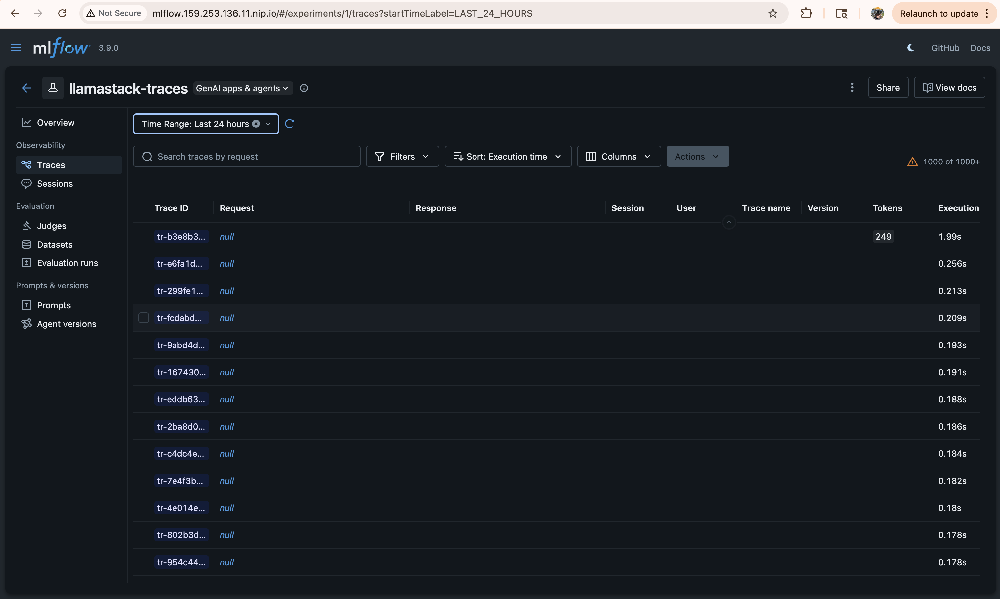
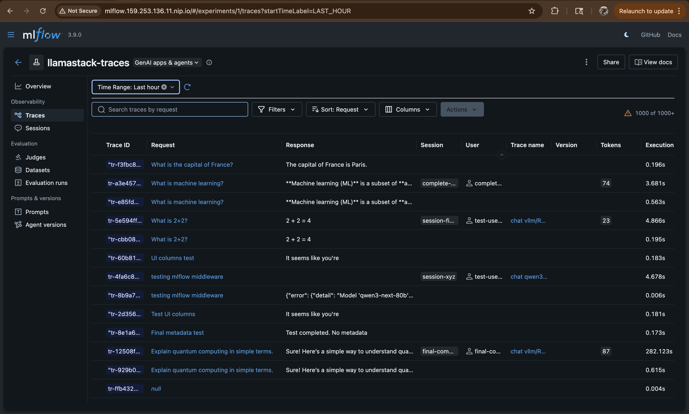

# MLflow Middleware & Enrichment Service (DEPRECATED)

**Deprecated:** March 17, 2026
**Replaced by:** OpenTelemetry auto-instrumentation (`opentelemetry-instrument llama stack run`)

This directory contains the deprecated MLflow middleware and enrichment service implementation that was used to populate MLflow UI fields from LlamaStack traces.

## The Problem

MLflow's OTLP trace ingestion endpoint (`/v1/traces`) accepts OpenTelemetry traces but has significant limitations:

**MLflow UI fields that remain empty with OTel-only approach:**
- **Session** - No session tracking in OTel
- **User** - No user identification
- **Version** - Model version not extracted from `gen_ai.request.model`
- **Trace Name** - Generic span names instead of descriptive labels
- **Request Preview** - OTel doesn't capture HTTP bodies (by design)
- **Response Preview** - Same limitation

**Root cause:** OpenTelemetry semantic conventions capture metadata as span *attributes* (`gen_ai.request.model`, `gen_ai.usage.input_tokens`, etc.), but MLflow's UI expects data in proprietary PostgreSQL tables (`trace_request_metadata`, `trace_tags`, `trace_info.request_preview`).

## Visual Comparison

### Without Middleware (Current State - Pure OTel)



**Result:** Traces appear in MLflow, but key UI fields remain `null`:
- Request/Response columns empty
- Session/User identification missing
- Version and Trace name not populated
- Only execution time and token counts visible

### With Middleware (Deprecated Approach)



**Result:** Full MLflow UI populated:
- Request shows actual prompts ("What is machine learning?", "What is 2+2?")
- Response shows model completions
- Session IDs tracked (`session-final-complete`, `session-xyz`)
- User identification present (`test-user`, `complete-user`)
- Trace names descriptive (`chat vllm/RedHatAI...`)
- Version extracted from model names

**Why we abandoned this:** The complexity and maintenance burden of the middleware outweighed the benefit of having these fields populated in MLflow UI, especially since Tempo/Grafana provides full trace visibility with proper GenAI semantic conventions.

## The Solution (This Deprecated Approach)

**Two-component architecture:**

### 1. MLflow Middleware (Injected into LlamaStack)

**Files:**
- `mlflow_middleware.py` (250 lines, full version)
- `preview_middleware.py` (80 lines, lightweight version)
- `Containerfile.full-middleware`
- `Containerfile.preview-middleware`
- `mlflow-configmap.yaml`
- `deployment-mlflow-patch.yaml`

**What it did:**
- Intercepted `/v1/chat/completions`, `/v1/embeddings`, `/v1/agents`
- Called MLflow SDK to create spans with full request/response bodies
- Extracted custom headers (`X-User-ID`, `X-Session-ID`) for metadata
- Scheduled background tasks to update MLflow database tables

### 2. Enrichment Service (Separate Kubernetes Deployment)

**Files:**
- `enrichment-service.py`
- `enrichment-deployment.yaml`

**What it did:**
- Polled PostgreSQL every 30 seconds for traces missing metadata
- Extracted `gen_ai.*`, `http.*`, `db.*` attributes from span JSONB
- Backfilled `trace_tags`, `trace_request_metadata`, `trace_info` tables

**Evolution:** Started with full 250-line middleware, refined to 80-line "preview middleware" + enrichment service to avoid duplicate spans.

## Why It Was Abandoned

Replaced with **pure OpenTelemetry auto-instrumentation**:

```bash
opentelemetry-instrument llama stack run
```

**Reasons:**
- Auto-instrumentation captures GenAI semantic conventions natively
- No custom code to maintain (no middleware, no enrichment polling)
- Traces flow directly: LlamaStack → OTel Collector → MLflow + Tempo
- Simpler architecture: eliminated 250+ lines of middleware code
- No duplicate span creation
- Standard observability approach (not MLflow-specific hacks)

**Trade-off accepted:** MLflow UI fields (Session, User, Version, Request/Response previews) remain empty, but full trace data visible in Tempo/Grafana with proper GenAI attributes.

## Current Architecture (Replacement)

```
LlamaStack Pod
└── opentelemetry-instrument (auto-instrumentation)
    └── Captures: gen_ai.*, http.*, db.* → spans with semantic conventions
            ↓
     OTel Collector
     - Transform: peer.service, mlflow.spanType
            ↓
       ┌────┴────┐
       ↓         ↓
   MLflow     Tempo
   (OTLP)     └→ Grafana
```

**Benefits:**
- Zero custom code in LlamaStack container
- Standard OTel instrumentation libraries
- Full trace hierarchy with FastAPI HTTP spans
- Database operations visible (asyncpg/sqlalchemy)
- GenAI semantic conventions properly populated
- Dual export to MLflow and Tempo simultaneously

## Files in This Directory

| File | Purpose |
|------|---------|
| `mlflow_middleware.py` | Full 250-line middleware with MLflow SDK |
| `preview_middleware.py` | Lightweight 80-line version (preview capture only) |
| `enrichment-service.py` | PostgreSQL polling service for metadata backfill |
| `Containerfile.*` | Various image build approaches tested |
| `MLFLOW_DEPLOYMENT.md` | Original deployment instructions |
| `IMPLEMENTATION_COMPLETE.md` | Final hybrid architecture documentation |
| `*.yaml` | Kubernetes manifests for middleware injection |

## References

- Journal entry: `~/Virtualenvs/journal/2026-03-17.md`
- Current MLflow README: [mlflow/README.md](../mlflow/README.md)
- Current LlamaStack deployment: [llamastack/README.md](../llamastack/README.md)

## Lessons Learned

1. **OpenTelemetry auto-instrumentation is sufficient** for GenAI observability when paired with proper backend (Tempo/Grafana)
2. **MLflow's OTLP support is limited** - designed for their proprietary SDK, not pure OTel workflows
3. **Middleware complexity compounds maintenance burden** - prefer standard instrumentation libraries
4. **Database polling for enrichment is fragile** - race conditions, timing dependencies, foreign key constraints
5. **HTTP body capture violates OTel design** - semantic conventions deliberately exclude bodies for security/performance
